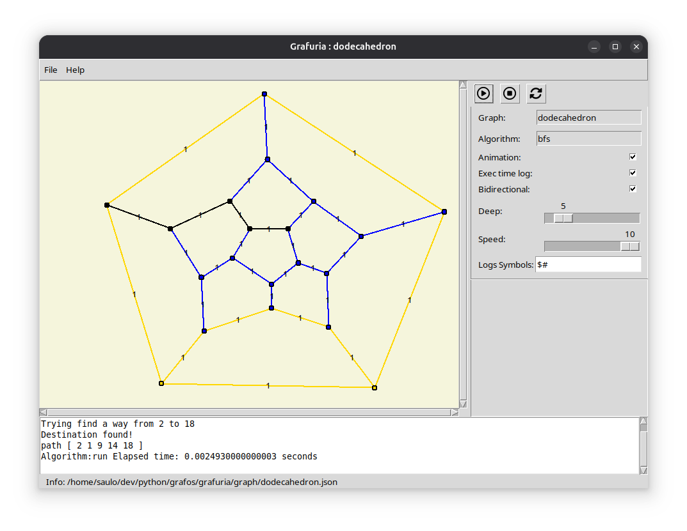

# Grafuria

Author: Saulo Popov Zambiasi

E-mail: saulopz@gmail.com

## About

This program is designed for creating graphs and executing algorithms written in the Lua programming language on them.

It allows users to easily construct directed and undirected graphs and weight connections. The software supports dynamic interaction with the graph using Lua scripts, allowing the execution of various algorithms to manipulate the structure and behavior of the graph.



## Tutorial

### Opening the Program via Command Line and Graphical Interface

```sh
$ python3 main.py gr=graphs/dodecaedron.json alg=lua/bfs.lua
```

Or just type `./grafuria` and the parameters in sequence. (Linux)

The parameters are optional and are used to open the program with a selected graph and/or a Lua algorithm to be executed on the graph.

If you choose to open a graph or algorithm in the already opened graphical interface, just click on the field next to __Graph__ to open a graph or on the field next to __Algorithm__ to open an algorithm.

In the settings bar on the right, at the top there are three buttons, __Play__, __Stop__ and __Refresh__:

- __Play__: Executes the algorithm on the selected graph.
- __Stop__: Interrupts the execution of the algorithm. It is important that some instructions are properly implemented in the algorithm when checking if the algorithm was interrupted with `app:is_stopped()`.
- __Refresh__: Clears the graph and logs. If the algorithm is running, interrupts it.

The __Checkbox__ are:

- __Animation__: Enables or disables showing the animation of the algorithm execution.

- __Speed__: Execution speed. 10 is the maximum speed, without using `Sleep` and 0 is the minimum speed.

The `Logs Symbols` field are special characters to use in the `app:log()` command. The first character of the string of this call will be evaluated and the program will only show this log, if the character is in the `Log Symbols` field.

### Creating a Graph

By opening the program without any parameters, you are ready to create a graph. If there is already a graph in the drawing area and you want to create a new one, just go to the `File... New...` menu. This will refresh the application.

- `Mouse button 2`: When you click the mouse wheel button, a new vertex is created in the drawing area.
- `Mouse button 1`: Used to select a vertex or an edge. A configuration area will appear in the right sidebar, at the bottom. There you configure the name of a vertex or the weight of an edge.
- `Mouse button 3`: This button is used to create a connection between a vertex A, which must already be previously selected, with a vertex B.

After creating or modifying your graph, just go to the `File... Save...` menu and choose the name and location where you want to save your graph.

# Writing the Algorithms

The Grafuria program uses the Lua programming language as its scripting language.

The default folder for algorithms is `lua/`, but you can create a subfolder and create your algorithm in that subfolder. This is especially useful when you want to modularize your algorithm into multiple files.

To create an algorithm, you can use your preferred IDE and open a script file with the `.lua` extension. However, to use Grafuria's features and interact with a graph opened in the interface, we use some classes and methods already registered in the application using the Python programming language.

## Class App

We have already created and registered an instance of the app class globally for your lua script, so just use its methods:

### `app:log(string)`:

Displays a log message in the area below the application.

__Example__:

```lua
app:log("#Vertex id: " .. v:get_id())
```

### `app:is_stopped() -> boolean`:

Checks if the algorithm's interrupt command was pressed. It is interesting to do this check inside loops.

__Example__:

```lua
if app:is_stopped() then
    return
end
```

### `app:set_solved(boolean)`:

Informs the application whether the algorithm has been solved or not.

__Example__:

```lua
app:set_solved(true)
```

### `app:get_vertex_size() -> integer`:

Returns the number of vertices in the graph. Very useful in loops where you want to scan all the vertices in the graph.

__Example__:

```lua
local vsize = app:get_vertex_size()
```

### `app:get_vertex(integer) - Vertex`:

Returns the vertex at position (integer) of the graph's vertex vector, passed as a parameter.

__Example__:

```lua
local vsize = app:get_vertex_size()
for i = 1, vsize do
    -- returns a vertex with id 'i'
    local v = app:get_vertex(i) 
    app:log("#Vertex(" .. i .. ") id = " .. v:get_id())
end
```

### `app:get_deep() -> integer`:

Returns how deep you can go in some kind of algorithm, such as BFS for example.

__Example__:

```lua
local deep = app:get_deep()
while level <= deep do
    --
    level = level + 1
end
```

### `app:step()`:

This command performs a control stop by the application and configured in the application. It pauses, with 0 being the slowest and 10 being no pause.

Use this command in loops where you change the state of a vertex or edge. This will give a more accurate and slower view, if you reduce the `Speed` information in the interface, of how things occur in your algorithm.

__Example__:

```lua
local vsize = app:get_vertex_size()
for i = 1, vsize do
    local v = app:get_vertex(i)
    v:set_state(State.ACTIVE)
    -- your code
    app:step()
end
```

# Class Vertex

Unlike the App class, where we already have an app instance to use, in our algorithm we need to allocate an object in memory to link to the graph vertex in the application.

### `get_id() -> integer`:

Gets the ID (integer top) of the vertex.

__Example__:

```lua
local v1 = app:get_vertex(1)
if v1 then
    app:log("#Vertex id: " ... v1:get_id())
end
```

### `get_name() -> string`:

Returns the name of vertex.

__Example__:

```lua
local v1 = app:get_vertex(1)
if v1 then
    app:log("#Vertex name: " ... v1:get_name())
end
```

### `get_state() -> integer`:

Receives the state of the vertex. The states can be:

* `State.None`: the vertex is not active.
* `State.TESTING`: the vertex is being evaluated.
* `State.ACTIVE`: vertex activated.

### `set_state(integer)`:

Changes the state of the vertex according to the states above. Every time we change the state of a vertex, or edge, if the `Animation` checkbox in the application is active, we change the color of the object.

__Example__:

```lua
v:set_state(State.ACTIVE)
```

### `is_connected(vertex) -> boolean`:

Checks if the vertex is connected with another vertex, passed as a parameter.

__Example__:

```lua
local a = app:get_vertex(1)
local b = app:get_vertex(2)
if a:is_connected(b) then
    app:log("$Vertex " .. a:get_id() .. " is connected with " .. b:get_id())
end
```

### `get_edge_size() -> integer`:

Returns how many connections a vertex has.

__Example__:

```lua
local esize = v:get_edge_size()
for i = 1, esize do
    local e = v:get_edge(i)
    -- your code here
end
```

### `get_edge(integer) -> Edge`:

Returns an edge at position `i` in the vector of edges connected to the vertex. The usage example has already been presented above.

### `get_active_edge_size() -> integer`:

Returns how many connections in the State.ACTIVE state this vertex has.

### `get_adjacent(Edge) -> Vertex`:

Returns the adjacent vertex of the current vertex, connected by the edge passed as a parameter, if there is a connection from the current vertex to the other.

__Example__:

```lua
local v = app:get_vertex(1) -- take the first vertex of the graph
if v and v:get_edge_size() > 0 then -- if v exists and it has connections
    local e = v:get_edge(1) -- grab the edge of the first connection
    local adjacent = v:get_adjacent(e)
    app:log("$Vertex " .. v:get_id() .. " is neighbor of " .. adjacent:get_id())
end
```

## Class Edge

Just like the Vertex class, Edge needs to be instantiated in the algorithm. Some methods have the same behavior as certain methods of the Vertex class, so I will not present examples.

### `get_id() -> integer`:

Returns the id of an edge.

### `get_state() -> integer`:

Returns the state of the edge. Edges that are being used in the graph to reach vertices also need to change their state in order to find paths.

### `set_state(integer)`:

Changes the state of an edge. As per the States already presented.

### `get_weight() -> float`:

Returns a `float` value with the weight of the connection or distance between two vertices.

### `set_weight(float)`:

Changes the value, in `float`, of the weight of the connection or distance between two vertices.

### `get_a() -> Vertex`:

Returns the vertex of one of the ends of the edge. If the graph is unidirectional, then `a` is the entry point.

### `get_b() -> Vertex`:

Returns the vertex of the other end of the edge. If the graph is unidirectional, then `b` is the tip of the arrow, or exit.

# Examples

I created some examples of __graphs__ in the `graph/` folder. You can use them, change them or create new graphs in this folder or even in another folder of your choice.

I also created two examples of graph __algorithms__ in the `lua/` folder. One is the `Depth-First Search` (DFS) which searches the path from a vertex `a` to a vertex `b`, both chosen randomly. And the other algorithm is the `Breadth First Search` (BFS), which does the same search, but with different behavior.

# Considerations

There are some things I haven't done yet and I intend, if I have time, to do them at another time. Among them are:

- In the case of unidirectional graphs, I did not include the option for a vertex to have an edge from `a` to `b` and another that returns from `b` to `a`. It is only possible to have one edge between these two vertices.
- I also do not have a circular edge, which starts from `a` and returns to `a` in the case of loops.
- Option to store the graph structure, and the path found, after executing the algorithm.

